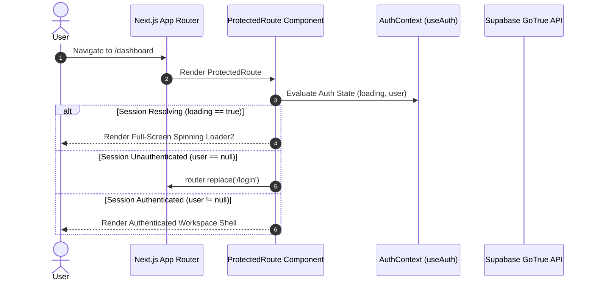

# SubSync AI — Master Architecture Specification

**Document Classification:** Official Engineering Specification (Volume 1 of 13)  
**Author:** Principal Software Architect & DevOps Lead  
**Version:** 4.0.0-ENTERPRISE  

---

## 1. Project Overview & Business Goals

SubSync AI is a production-grade, real-time cloud workstation designed for video subtitle synchronization, conversion, and quality assurance.
The primary business objective is to reduce caption engineering turnaround times by 80% through instant browser-side `.srt` to WebVTT conversion, live video overlay previewing, and automated diagnostic heuristics (Characters Per Second / Words Per Minute compliance checks).

---

## 2. Exhaustive Folder Topology & Module Responsibilities

```text
d:/Project_IDEA/SubSync AI/
├── app/
│   ├── (app)/                           # Authenticated Workspace Route Group
│   │   ├── layout.tsx                   # AppShell (AppSidebar, MobileNav, ProtectedRoute)
│   │   ├── dashboard/page.tsx           # Studio Ingestion Console (/dashboard)
│   │   ├── library/                     # Video & Subtitle Catalog Routes
│   │   │   ├── page.tsx                 # Video Library Grid/List Catalog (/library)
│   │   │   ├── [id]/page.tsx            # Video Playback Studio (/library/[id])
│   │   │   └── subtitles/
│   │       ├── page.tsx             # Subtitle Asset Management (/library/subtitles)
│   │       └── [id]/page.tsx        # Interactive Subtitle DAW Editor (/library/subtitles/[id])
│   │   ├── my-videos/page.tsx           # Job Operations Workspace (/my-videos)
│   │   ├── profile/page.tsx             # User Profile Overview (/profile)
│   │   └── settings/page.tsx            # Workspace Security & Preferences (/settings)
│   ├── api/                             # REST Backend Handlers
│   │   ├── jobs/                        # Job Ingestion, Update & Purge Routes
│   │   └── subtitles/                   # VTT Streaming & Attachment Export Routes
│   ├── login/page.tsx                   # Public Authentication Gateway (/login)
│   ├── register/page.tsx                # Account Setup Portal (/register)
│   ├── layout.tsx                       # Root Application Shell & Theme Providers
│   └── page.tsx                         # Root Entry Router Interceptor (/)
├── components/
│   ├── dashboard/                       # Dashboard Feature Modules
│   ├── subtitles/editor/                # Subtitle DAW Editor Workstation Components
│   └── ui/                              # Radix/Tailwind Atomic UI Primitives
├── lib/
│   ├── actions/subtitles.ts             # Next.js Server Actions for Subtitle CRUD
│   ├── contexts/auth-context.tsx        # React Context Session Provider
│   ├── hooks/                           # Custom Hooks (State, Validation, Auto-Save)
│   ├── supabase/                        # Supabase Client Factories
│   ├── types/database.ts                # TypeScript Database Schema Definitions
│   └── utils/subtitle-converter.ts      # High-Speed SRT <-> WebVTT Engine
└── supabase/migrations/                 # SQL Schemas, Storage Buckets & RLS Policies
```

---

## 3. Core System Architecture & Data Flow

```mermaid
graph TD
    Client["Next.js 14 Client Shell (React 18 + Tailwind + Radix UI)"] <-->|REST / JSON| APIRoutes["Next.js API Handlers (/api/*)"]
    Client <-->|Server Actions| Actions["lib/actions/subtitles.ts"]
    Client <-->|WebSockets (postgres_changes)| Realtime["Supabase Realtime Broadcast"]
    APIRoutes <-->|Parameterized SQL| DB["Supabase PostgreSQL 15 Database"]
    Actions <-->|Object Streaming| Storage["Supabase Storage (subtitles bucket)"]
```

---

## 4. Authentication, Authorization & Routing Lifecycle



---

## 5. Technical Debt & Refactoring Opportunities

1. **Repeated API Middleware Logic:** Route handlers (`/api/jobs/create`, `/api/jobs/update`) repeat bearer token extraction and Supabase client initialization. Extracting this into a unified wrapper (`withAuthHandler`) will enforce DRY maintainability.
2. **Synchronous Main-Thread Parsing:** Client-side conversion (`srtToVtt`) runs synchronously on the UI thread. Offloading string parsing to Web Workers (`subtitle-worker.js`) prevents UI freezing during massive file uploads (>10MB).
