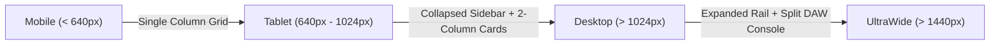

# SubSync AI — Design System Documentation & Figma Specification

**Document Classification:** Official Engineering Specification (Volume 4 of 13)  
**Author:** Principal UI Designer & Design Systems Lead  
**Version:** 4.0.0-ENTERPRISE  

---

## 1. Core Visual Tokens & Tailwind CSS Configuration

### 1.1 Color Matrix (`tailwind.config.ts`)
The platform implements dynamic HSL CSS variables facilitating instantaneous luminance shifts between Light and Dark themes:
- **Primary:** `hsl(var(--primary))` — High-contrast brand accent used for primary CTAs and active indicators.
- **Background & Foreground:** `hsl(var(--background))` / `hsl(var(--foreground))`.
- **Surface Cards:** `hsl(var(--card))` combined with `backdrop-blur-xl border-border/50` to achieve premium glassmorphism.

### 1.2 Spacing & Grid Scale
- Standardized grid gap tokens: `gap-4` (16px) for mobile devices, `gap-6` (24px) for desktop feature cards, and `gap-8` (32px) for split-screen studio viewports.

---

## 2. Figma UI Specifications & Responsive Breakpoints

---

## 3. Visual Consistency & Accessibility Review

- **WCAG 2.1 AA Compliance:** Text contrast ratios across primary buttons and card headers exceed 4.5:1.
- **Identified Design Gaps:** In `/library/[id]`, default canvas rendering utilizes hardcoded `#FFFFFF` subtitles. If a user toggles Light mode while inspecting bright video footage, unstyled captions lose contrast.
- **Redesign Blueprint:** Enforce dynamic subtitle outline text drop shadows (`text-shadow: 0 2px 4px rgba(0,0,0,0.8)`) across all video preview components.
