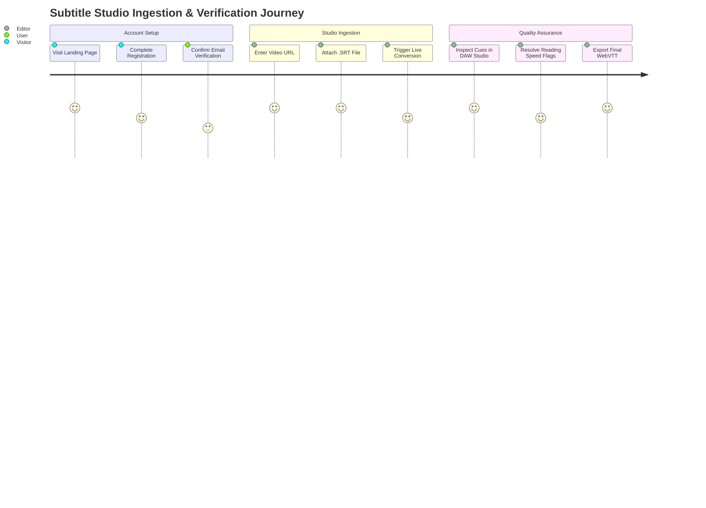

# SubSync AI — User Experience Documentation & Workflow Audit

**Document Classification:** Official Engineering Specification (Volume 5 of 13)  
**Author:** Principal UX Designer & Product Research Lead  
**Version:** 4.0.0-ENTERPRISE  

---

## 1. End-to-End User Journey Maps

---

## 2. UX Pain Points & Actionable Blueprints

1. **Tablet Sidebar Collapse Friction:** On viewports between `768px` and `1024px`, the primary vertical rail (`AppSidebar`) hides completely (`hidden lg:block`). This forces editors to repeatedly open the mobile drawer to switch between the Library and Studio.
   - *Redesign Blueprint:* Implement a slim, icons-only collapsed rail view (`w-16`) on tablet devices.
2. **Keyboard Shortcut Discoverability:** Editors frequently rely on hotkeys (`Ctrl+Z`, `Ctrl+Enter`), yet discoverability is restricted to static subheaders.
   - *Redesign Blueprint:* Integrate dynamic `<Tooltip>` wrappers around interactive studio triggers.
