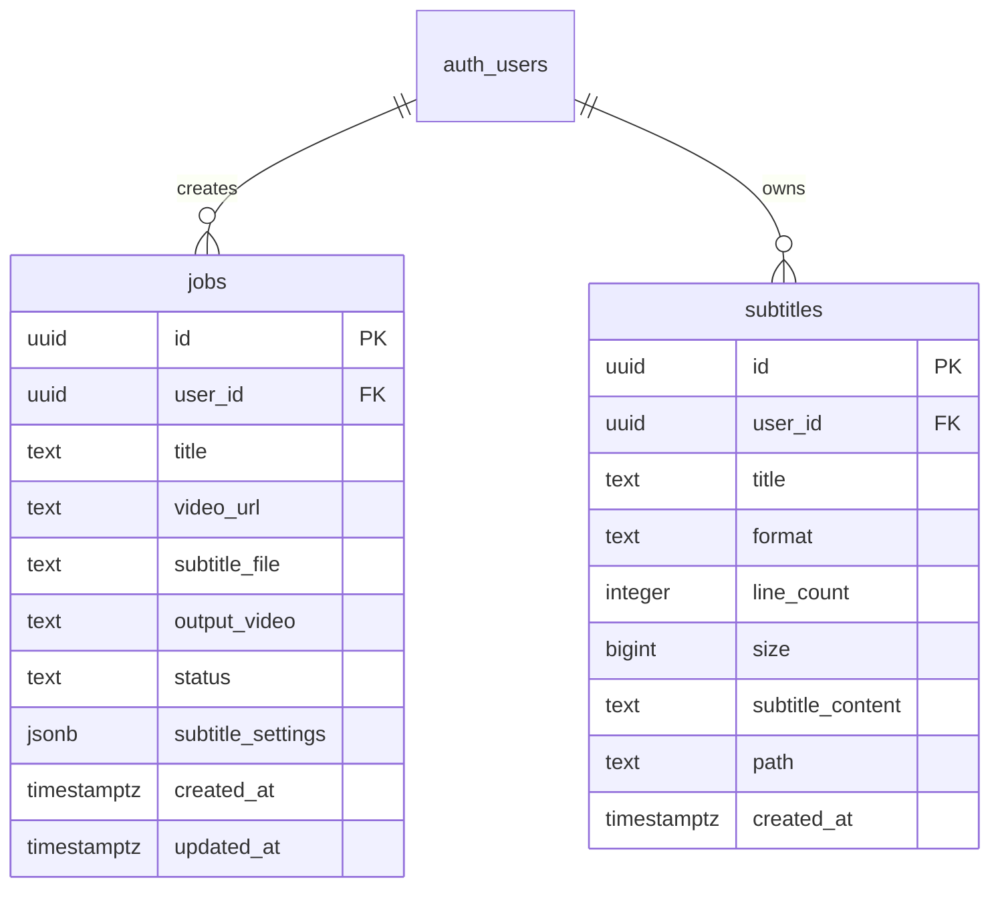

# SubSync AI — Complete Database Architecture & RLS Matrix

**Document Classification:** Official Engineering Specification (Volume 6 of 13)  
**Author:** Database Architect & Cloud Infrastructure Lead  
**Version:** 4.0.0-ENTERPRISE  

---

## 1. PostgreSQL Entity Relationship Diagram (ERD)

---

## 2. Row-Level Security (RLS) Policies & Storage Buckets

### 2.1 Table RLS Enforcement Matrix
- **`jobs` Table:**
  - `SELECT`: `auth.uid() = user_id`
  - `INSERT`: `auth.uid() = user_id` (Prevents foreign tenant spoofing)
  - `UPDATE`/`DELETE`: `auth.uid() = user_id`
- **`subtitles` Table:**
  - Identical strict tenant isolation policies enforced via Supabase GoTrue authentication hooks.

### 2.2 Storage Bucket (`subtitles`)
- **Bucket Classification:** Private object storage bucket.
- **Object Naming Convention:** `${user_id}/${timestamp}_${index}_${sanitizedFilename}.vtt`
- **Security Policy:** Folder-level RLS verifying `(storage.foldername(name))[1] = auth.uid()::text`.
