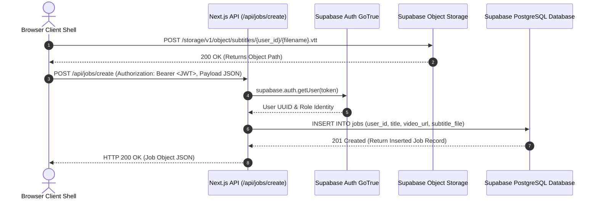
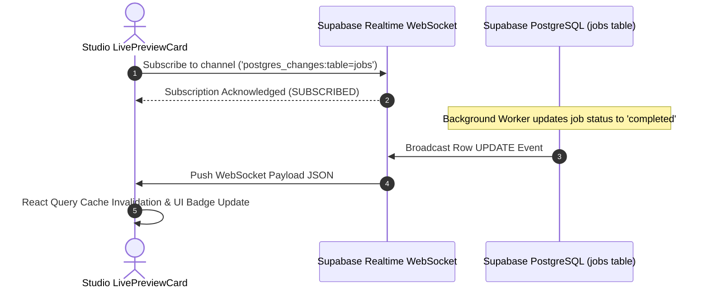

# SubSync AI — Complete API Sequence Catalog

**Document Classification:** Official Engineering Specification (Volume 16 of 34)  
**Author:** Architecture Review Board & Principal Backend Lead  
**Version:** 5.0.0-ENTERPRISE  

---

## 1. Sequence Catalog Scope & Protocol Standards

This sequence catalog documents all synchronous and asynchronous HTTP/WebSocket handshakes executed between browser clients, Next.js API Route Handlers, and Supabase cloud infrastructure.

---

## 2. Sequence 1: Job Creation & Cloud Blob Attachment

---

## 3. Sequence 2: Realtime WebSocket State Synchronization

