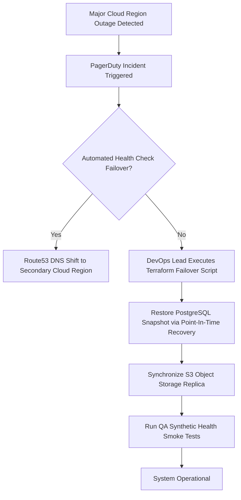

# SubSync AI — Backup & Disaster Recovery Plan (DRP)

**Document Classification:** Official Engineering Specification (Volume 26 of 34)  
**Author:** Architecture Review Board & Principal Cloud Infrastructure Lead  
**Version:** 5.0.0-ENTERPRISE  

---

## 1. Recovery Objectives & SLAs
- **Recovery Point Objective (RPO):** Point-in-time recovery (PITR) within 5 minutes for PostgreSQL relational data; daily snapshot replication for Object Storage blobs.
- **Recovery Time Objective (RTO):** Complete service restoration within 45 minutes following regional cloud outage.

---

## 2. Disaster Recovery Protocol & Runbook

