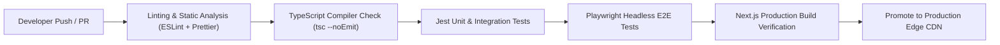

# SubSync AI — CI/CD Pipeline & Automated Deployment Architecture

**Document Classification:** Official Engineering Specification (Volume 28 of 34)  
**Author:** Architecture Review Board & Principal DevOps Lead  
**Version:** 5.0.0-ENTERPRISE  

---

## 1. Automated Pipeline Workflow Specification

---

## 2. GitHub Actions YAML Pipeline Specification
The pipeline ensures code cannot merge into main branch without passing 100% of automated verification gates.
