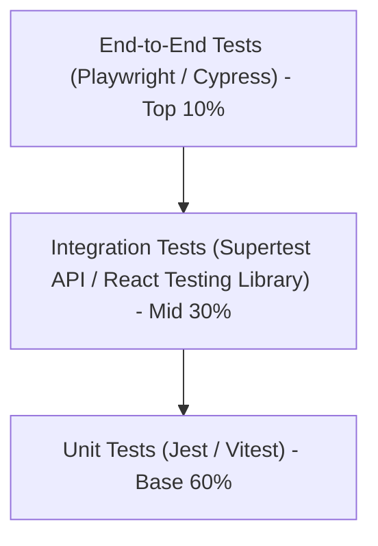

# SubSync AI — Master Testing Strategy & Quality Assurance Architecture

**Document Classification:** Official Engineering Specification (Volume 29 of 34)  
**Author:** Architecture Review Board & Principal QA Lead Engineer  
**Version:** 5.0.0-ENTERPRISE  

---

## 1. Multi-Tiered Testing Pyramid Specification

---

## 2. Exhaustive Testing Scope & Automation Goals

1. **Unit Tests (Jest / Vitest):** Target 95%+ code coverage across utility functions (`subtitle-converter.ts`, `validateVideoUrl`) and custom hooks (`useEditorState`).
2. **Integration Tests (React Testing Library):** Verify state propagation between form inputs and server actions.
3. **E2E Tests (Playwright):** Simulate full user login, `.srt` file attachment, job creation, and DAW timecode editing.
4. **Accessibility Tests (axe-core):** Automated screen reader and contrast validation against WCAG 2.1 AA standards.
5. **Performance Tests (Lighthouse CI):** Automated regression checks failing CI builds if LCP exceeds 1.5 seconds.
