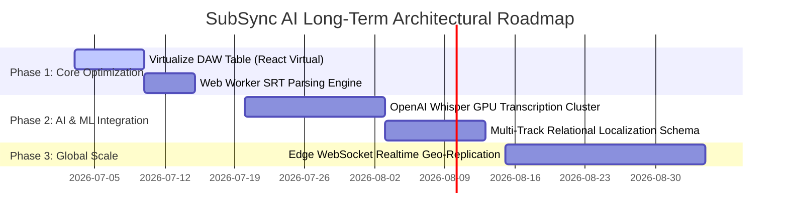

# SubSync AI — Future Architecture Roadmap & Scaling Blueprint

**Document Classification:** Official Engineering Specification (Volume 33 of 34)  
**Author:** Architecture Review Board & Chief Technology Officer  
**Version:** 5.0.0-ENTERPRISE  

---

## 1. Multi-Year Architectural Evolution Gantt

