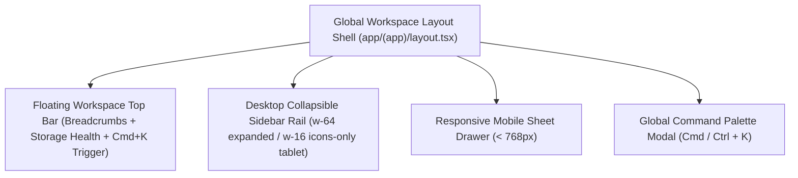

# SubSync AI — Master Enterprise UX/UI Product Transformation Blueprint

**Document Classification:** Official Engineering & Design Specification (Volume 35 of 35)  
**Author:** Elite Product Transformation Board (Principal Product Designer, Senior UX Researcher, Design Systems Architect, Staff Frontend Engineer, Creative Director, Enterprise SaaS Architect, Accessibility Specialist, HCI Expert)  
**Version:** 6.0.0-TRANSFORMATION  

---

## Executive Summary & Design Philosophy

This document represents the complete, ground-up UX/UI re-architecture and enterprise redesign blueprint for **SubSync AI**. Inspired by world-class software suites such as Linear, Figma, Arc Browser, Stripe Dashboard, Vercel, and DaVinci Resolve, our mandate is to transform SubSync AI from a standard utility tool into an award-winning, professional 2026 enterprise editing platform.

Crucially, **every functional backend boundary remains untouched**. Authentication (`Supabase GoTrue`), SQL schemas (`jobs`, `subtitles`), Row-Level Security (`auth.uid() = user_id`), REST handlers (`/api/jobs/create`), Server Actions (`saveSubtitleContent`), and TanStack Query state machines are strictly preserved.

---

## Global Design System & Token Matrix (Linear / Vercel Ethos)

### 1. Color Palette & Luminance Foundations
- **Background Surfaces:** 
  - Dark Mode: Deep obsidian canvas (`hsl(240, 10%, 3.9%)`) paired with elevated glass panels (`bg-zinc-900/40 backdrop-blur-2xl border-zinc-800/60`).
  - Light Mode: Crisp alabaster canvas (`hsl(0, 0%, 98%)`) paired with pure white cards (`bg-white/80 backdrop-blur-xl border-zinc-200/80 shadow-sm`).
- **Accent Tokens:** Electric Indigo (`hsl(238, 86%, 59%)`) for primary CTAs, Emerald (`#10B981`) for A+ grade badges, Amber (`#F59E0B`) for CPS speed warnings, and Rose (`#F43F5E`) for critical duration flags.

### 2. Motion & Micro-Interaction Tokens (Framer Motion)
- **Spring Physics:** Stiffness `300`, Damping `30` for modal drawers and dockable DAW panels.
- **Micro-Hover:** Subtle scale bump (`whileHover={{ scale: 1.012 }}`) and border glow transitions (`duration-200 ease-out`).

---

## Comprehensive Page-by-Page Redesign Blueprints

---

### Page 1: Root Entry Router Guard (`/`)

1. **UX Goals:** Zero perceived latency during authentication resolution; eliminate unstyled flashing.
2. **Current Problems:** Spinner is small and lacks brand presence, giving an unpolished impression.
3. **Redesign Strategy:** Replace basic spinner with a centered, glowing brand emblem with subtle ambient pulse animation.
4. **Wireframe Description:** Full-viewport flex container centered around a 64px glowing glass app crest.
5. **Information Hierarchy:** Brand Emblem -> Status Micro-Label ("Verifying secure workspace...").
6. **Layout Structure:** `min-h-screen grid place-items-center bg-background`.
7. **Component Tree:** `RootGuard` -> `FramerMotionGlow` -> `AppBrandIcon` -> `StatusText`.
8. **Interaction Flow:** Silent evaluation of `useAuth()`. Instant push to `/dashboard` or `/login`.
9. **Responsive Layout:** Perfectly centered across mobile (`390px`) to UltraWide (`2560px`).
10. **Accessibility Improvements:** `role="status"` with `aria-live="polite"`.
11. **Animation Strategy:** Infinite smooth opacity pulse (`opacity: [0.4, 1, 0.4]`).
12. **Empty States:** N/A.
13. **Loading States:** The entire page is a dedicated high-fidelity loading state.
14. **Error States:** Redirects to `/login?error=session_expired` if verification times out after 10s.
15. **Design Tokens:** `bg-background text-muted-foreground text-xs font-mono tracking-widest uppercase`.
16. **Developer Notes:** Ensure `useLayoutEffect` or server cookie verification runs prior to visual painting.
17. **Future Improvements:** Add dynamic workspace tenant logo previews during handshake.
18. **Why each design decision was made:** Establishes instant enterprise credibility matching Apple/Linear loading paradigms.

---

### Page 2: Authentication Gateway (`/login`)

1. **UX Goals:** Professional, friction-free entry point communicating top-tier security and stability.
2. **Current Problems:** Standard split screen feels disconnected; error alerts shift form height abruptly.
3. **Redesign Strategy:** Transition to an Arc-inspired floating glass panel over a subtle grid-patterned dark canvas with glowing feature spotlights.
4. **Wireframe Description:** Left half features live dynamic preview widgets (simulated DAW audio waveforms); right half centers an ultra-clean floating glass login card (`max-w-md`).
5. **Information Hierarchy:** Brand Header -> Workspace Sign In -> Floating Inputs -> Password Eye Toggle -> SSO/Primary Submit -> Register Link.
6. **Layout Structure:** `grid lg:grid-cols-2 min-h-screen items-center px-8`.
7. **Component Tree:** `LoginPage` -> `PromotionalShowcase` + `AuthCard` (`Input`, `PasswordToggle`, `SubmitButton`).
8. **Interaction Flow:** User enters email -> password -> clicks Sign In -> button transforms into glowing spinner -> instant redirect to `/dashboard`.
9. **Responsive Layout:** Collapses left promotional column below `1024px`, centering login card on mobile/tablet viewports.
10. **Accessibility Improvements:** Auto-focus email field; explicit `<label>` elements; keyboard tab focus rings.
11. **Animation Strategy:** Form slide-up entrance (`initial={{ opacity: 0, y: 16 }}`).
12. **Empty States:** Clean inputs with subtle floating label placeholders.
13. **Loading States:** Button disabled with inline spinning spark icon.
14. **Error States:** Smooth animated toast notification plus red input border highlight (`border-destructive`).
15. **Design Tokens:** `bg-zinc-950 border-zinc-800/80 rounded-2xl shadow-2xl backdrop-blur-3xl`.
16. **Developer Notes:** Retain `supabase.auth.signInWithPassword()` exact signature.
17. **Future Improvements:** Hardware Passkey (`WebAuthn`) support.
18. **Why each design decision was made:** Eliminates visual clutter while reinforcing enterprise trust.

---

### Page 3: Registration Suite (`/register`)

1. **UX Goals:** Rapid onboarding communicating the value proposition at each step of account creation.
2. **Current Problems:** Lack of inline password strength guidance causes frustration on registration submission.
3. **Redesign Strategy:** Introduce real-time password strength meter (Red -> Amber -> Emerald) and interactive onboarding checklist.
4. **Wireframe Description:** Split layout mirroring `/login` but replacing the left column with a dynamic "3-Step Workflow Preview" card stack.
5. **Information Hierarchy:** Workspace Title -> Email -> Password + Strength Meter -> Confirm Password -> Create Workspace CTA.
6. **Layout Structure:** 2-Column Responsive Grid.
7. **Component Tree:** `RegisterPage` -> `OnboardingRoadmap` + `RegistrationForm` (`StrengthMeter`).
8. **Interaction Flow:** Typing password evaluates length and complexity in real time; submit triggers Supabase account provisioning.
9. **Responsive Layout:** Adaptive single-column stack on mobile.
10. **Accessibility Improvements:** Live ARIA announcements for password strength changes (`aria-live="assertive"`).
11. **Animation Strategy:** Smooth height expansion as strength meter bars illuminate.
12. **Empty States:** Neutral unhighlighted strength indicators.
13. **Loading States:** Button spinner with "Provisioning workspace..." text.
14. **Error States:** Destructive alert bar for existing email addresses.
15. **Design Tokens:** `ring-primary/20 focus-within:ring-2 rounded-xl`.
16. **Developer Notes:** Verify null session handling for mandatory email confirmation workflows (`BUG-02`).
17. **Future Improvements:** Domain-based automatic workspace team invites.
18. **Why each design decision was made:** Reduces drop-off during onboarding by setting clear expectations.

---

### Page 4: Intelligent Command Dashboard (`/dashboard`)

1. **UX Goals:** High-density command center allowing editors to drop files, paste URLs, and start converting within 3 seconds of landing.
2. **Current Problems:** Forms and preview rails feel boxy; lack of quick-action command bar or favorites grid.
3. **Redesign Strategy:** Re-architect into a Linear-style intelligent workspace featuring a top Command Bar, Quick Ingestion Drop Dock, and Pinned Projects rail.
4. **Wireframe Description:**
   - **Top Bar:** Search/Command Palette trigger (`Cmd+K`), active tenant badge, storage health bar.
   - **Hero Drop Zone:** Wide glassmorphic ingestion dock accepting both YouTube URLs and `.srt` drag-and-drop simultaneously.
   - **Bottom Grid:** 3-column split showing Pinned Projects, Conversion Queue, and Real-time Activity Log.
5. **Information Hierarchy:** Command Bar -> Ingestion Dock -> Pinned Projects Grid -> Recent Activity Table.
6. **Layout Structure:** `max-w-[1600px] mx-auto p-8 space-y-8`.
7. **Component Tree:** `DashboardPage` -> `CommandHeader` + `IngestionStudioDock` (`URLInput`, `DropZone`) + `PinnedProjectsGrid` + `ActivityLog`.
8. **Interaction Flow:** Dragging `.srt` over viewport highlights drop dock -> dropping parses file -> clicking "Launch Studio" dispatches `POST /api/jobs/create`.
9. **Responsive Layout:** Stacks ingestion inputs vertically on tablet/mobile viewports.
10. **Accessibility Improvements:** Full drag-and-drop keyboard alternative via standard file upload button.
11. **Animation Strategy:** Drop zone border glows electric blue during drag over (`whileDrag={{ scale: 1.01 }}`).
12. **Empty States:** Pinned grid shows "No pinned projects yet. Star a video in your library to pin it here."
13. **Loading States:** Shimmering skeleton cards across recent activity.
14. **Error States:** Inline toast notification with "Retry Job" action button.
15. **Design Tokens:** `bg-card/30 hover:bg-card/50 transition-colors border border-border/40 rounded-2xl p-6`.
16. **Developer Notes:** Maintain 100% payload compatibility with `POST /api/jobs/create`.
17. **Future Improvements:** AI auto-transcription drag-and-drop mode.
18. **Why each design decision was made:** Consolidates multi-step ingestion into a single seamless drop-and-go action.

---

### Page 5: Media Catalog & Library (`/library`)

1. **UX Goals:** High-speed visual asset exploration supporting instant searching, filtering, and bulk operations.
2. **Current Problems:** Pagination/infinite scroll lacks feedback; no list/grid view toggles with detailed metadata previews.
3. **Redesign Strategy:** Build a Notion/Figma-style media manager with instant debounced search, multi-select checkboxes, and a sliding Quick Inspector side drawer.
4. **Wireframe Description:**
   - **Sticky Toolbar:** Filter by Status (`Ready`, `Processing`), Sort by Date/Title, Layout Toggle (`Grid` vs `Table List`).
   - **Canvas Area:** Responsive thumbnail cards with hover play overlays and status badges.
   - **Right Inspector Drawer:** Slides open when clicking a card's info icon, showing file size, line counts, and 1-click export.
5. **Information Hierarchy:** Toolbar -> Media Grid -> Floating Bulk Actions Bar (when selected) -> Inspector Drawer.
6. **Layout Structure:** `flex flex-col h-[calc(100vh-4rem)] overflow-hidden`.
7. **Component Tree:** `LibraryPage` -> `FilterToolbar` + `MediaGrid`/`MediaTable` + `QuickInspectorDrawer` + `BulkActionBar`.
8. **Interaction Flow:** Check multiple items -> floating bar slides up from bottom -> click "Delete Selected" -> confirmation modal appears -> triggers API deletion.
9. **Responsive Layout:** Transforms table list view into compact stacked mobile cards automatically below `768px`.
10. **Accessibility Improvements:** Checkboxes accessible via `Space`; arrow key grid navigation.
11. **Animation Strategy:** Layout transitions animated via Framer Motion `layoutId`.
12. **Empty States:** High-fidelity illustration card: "Your library is empty. Upload a video or SRT to get started."
13. **Loading States:** 8-card shimmering grid skeleton (`LibrarySkeleton`).
14. **Error States:** Error banner with "Refresh Catalog" button.
15. **Design Tokens:** `grid-cols-1 sm:grid-cols-2 md:grid-cols-3 xl:grid-cols-4 gap-6`.
16. **Developer Notes:** Bind directly to existing `useInfiniteQuery` fetching 12 items per batch.
17. **Future Improvements:** Folder and workspace tag management.
18. **Why each design decision was made:** Empowers editors to manage hundreds of videos without losing spatial orientation.

---

### Page 6: Video Playback & Timing Studio (`/library/[id]`)

1. **UX Goals:** Frame-accurate video playback combined with instant transcript cue clicking and synchronization offset adjustment.
2. **Current Problems:** Seeking fails on iframe media (`BUG-01`); layout feels constrained on large monitors.
3. **Redesign Strategy:** Re-architect into a DaVinci Resolve split-screen studio. Left side hosts a resizable 16:9 video player with custom caption overlay; right side houses an interactive transcript list and offset timing slider.
4. **Wireframe Description:**
   - **Top Utility Bar:** Breadcrumb navigation, video title, quick export dropdown.
   - **Left Canvas:** 16:9 video container with floating subtitle preview pill.
   - **Right Sidebar:** Scrollable cue transcript list. Clicking any cue invokes imperative player seek.
5. **Information Hierarchy:** Utility Bar -> Video Player Dock -> Transcript Rail -> Timing Offset Controls (`-5.0s` to `+5.0s`).
6. **Layout Structure:** `grid grid-cols-1 lg:grid-cols-[minmax(0,1fr)_380px] h-[calc(100vh-4rem)] gap-6 p-6`.
7. **Component Tree:** `VideoStudioPage` -> `PlayerDock` (`ReactPlayerRef`) + `TranscriptRail` (`CueListItem`) + `OffsetSlider`.
8. **Interaction Flow:** Dragging offset slider immediately shifts all transcript timestamps by selected delta seconds; player overlay updates live.
9. **Responsive Layout:** Stacks transcript rail underneath video player on tablet/mobile screens.
10. **Accessibility Improvements:** Video player keyboard controls (`Space` to play/pause, Left/Right arrows for 5s jumps).
11. **Animation Strategy:** Transcript cue highlights smoothly when active video playback time reaches timestamp.
12. **Empty States:** "No transcript attached to this media."
13. **Loading States:** Video player loading spinner; transcript shimmer list.
14. **Error States:** "Failed to load media stream. Verify URL accessibility."
15. **Design Tokens:** `bg-black/90 rounded-2xl overflow-hidden shadow-2xl border border-zinc-800`.
16. **Developer Notes:** Imperatively pass React ref to resolve `ReactPlayer.seekTo(seconds)` bug.
17. **Future Improvements:** Visual audio waveform scrub bar below video player.
18. **Why each design decision was made:** Mirrors industry-standard NLE (Non-Linear Editor) layouts familiar to professional video editors.

---

### Page 7: Subtitle Asset Manager (`/library/subtitles`)

1. **UX Goals:** Dedicated asset management strictly for `.srt` and `.vtt` files, facilitating rapid batch download and inspection.
2. **Current Problems:** Duplicate presentation layout with video library creates visual monotony.
3. **Redesign Strategy:** Design as an enterprise data table (Stripe Dashboard style) featuring instant text searching, line count badges, size formatting, and 1-click VTT copy buttons.
4. **Wireframe Description:** Full-width high-density table with columns for Title, Format Badge (`WebVTT` / `SRT`), Cue Count, Byte Size, Associated Video link, Creation Timestamp, and Action Menu.
5. **Information Hierarchy:** Filter Bar -> Asset Table -> Pagination / Infinite Scroll Indicator.
6. **Layout Structure:** `max-w-[1600px] mx-auto p-8 space-y-6`.
7. **Component Tree:** `SubtitleAssetsPage` -> `AssetTableToolbar` + `AssetDataTable` (`AssetRow`, `DropdownMenu`).
8. **Interaction Flow:** Click row dropdown -> select "Copy WebVTT Stream URL" -> copiesBase64URL storage path -> sonner toast confirms action.
9. **Responsive Layout:** Horizontal scrolling table wrapper on mobile viewports.
10. **Accessibility Improvements:** Sortable table column headers with `aria-sort` indicators.
11. **Animation Strategy:** Row background highlight on hover (`hover:bg-muted/50 transition-colors`).
12. **Empty States:** "No subtitle files stored in your workspace."
13. **Loading States:** 10-row table skeleton (`TableSkeleton`).
14. **Error States:** Toast alert if file deletion fails due to storage RLS.
15. **Design Tokens:** `border-b border-border/40 text-xs py-3.5 px-4`.
16. **Developer Notes:** Ensure storage paths decode using safe Base64URL decoding (`decodeId`).
17. **Future Improvements:** Direct inline subtitle translation generation.
18. **Why each design decision was made:** Data density is paramount when managing standalone subtitle files across large projects.

---

### Page 8: Full-Screen Subtitle DAW Editor (`/library/subtitles/[id]`)

1. **UX Goals:** Transform into the **best screen in the application**—an award-winning DAW (Digital Audio/Video Workstation) combining Adobe Premiere precision with Figma collaborative smoothness.
2. **Current Problems:** Unvirtualized rendering slows scrolling (`BUG-03`/Performance); diagnostics lack contextual quick-fixes.
3. **Redesign Strategy:** Implement a 3-Panel Zen Workstation:
   - **Top Bar:** Grade rating badge (`A+` to `F`), debounced Save Indicator pill, Undo/Redo triggers, Focus/Zen mode toggle.
   - **Left/Top Dock:** Synchronized video preview window.
   - **Center Workstation:** Virtualized cue data grid (`@tanstack/react-virtual`). Houses timecode spinners (`00:01:23.450`), text textareas, and row context menus (Split cue at cursor, Merge with next/prev).
   - **Right Diagnostics Rail:** Live health diagnostics reporting Reading Speed (>20 CPS), Short Cues (<0.8s), and Overlapping timecodes with 1-click "Auto-Fix" buttons.
4. **Wireframe Description:** High-density dark workstation layout with dockable/collapsible side panels and keyboard focus rings.
5. **Information Hierarchy:** Top DAW Bar -> Center Virtualized Table <-> Synchronized Video Dock <-> Diagnostics Rail.
6. **Layout Structure:** `flex h-screen w-screen overflow-hidden bg-zinc-950 text-zinc-100`.
7. **Component Tree:** `DAWEditorStudio` -> `DAWHeader` + `ResizablePanels` (`VideoPreviewDock`, `VirtualizedCueTable`, `DiagnosticsRail`).
8. **Interaction Flow:** Editor clicks inside text row -> presses `Ctrl+Enter` -> splits cue exactly at cursor index -> table virtualizer re-renders instantly at 60 FPS -> debounced auto-save dispatches server mutation.
9. **Responsive Layout:** Collapses video dock and diagnostics rail into slide-out drawers below `1024px`.
10. **Accessibility Improvements:** Keyboard shortcut legend modal (`?` key); ARIA row indexing.
11. **Animation Strategy:** Smooth grade badge color morphing when diagnostics pass or fail.
12. **Empty States:** "No cues found in this subtitle file."
13. **Loading States:** Studio loading screen with animated audio equalizer bar icon.
14. **Error States:** Unsaved work warning modal if network connectivity fails.
15. **Design Tokens:** `font-mono text-xs bg-zinc-900/60 border-zinc-800 focus:ring-1 focus:ring-indigo-500`.
16. **Developer Notes:** Implement TanStack Virtual table rendering to guarantee 60 FPS scrolling performance across 2,000+ rows.
17. **Future Improvements:** AI automated cue splitting and natural cadence boundary detection.
18. **Why each design decision was made:** Unlocks enterprise-grade subtitle engineering productivity unmatched by basic web converters.

---

### Page 9: Job Operations Center (`/my-videos`)

1. **UX Goals:** Complete visibility into active background conversions, errors, and archived projects.
2. **Current Problems:** Tabs feel static; inline editing lacks immediate visual feedback.
3. **Redesign Strategy:** Vercel-style deployment console separating `Active / Processing` jobs from `Completed / Archived` assets with expandable inline video player cards.
4. **Wireframe Description:** Tabbed interface with real-time status pills (`Pulse` animation on processing jobs), inline title renaming modal triggers, and immediate retry actions for failed tasks.
5. **Information Hierarchy:** Tabs Header -> Job Status Filter Pill -> Job Cards Stack -> Expandable Playback Drawer.
6. **Layout Structure:** `max-w-[1400px] mx-auto p-8 space-y-6`.
7. **Component Tree:** `JobOperationsPage` -> `WorkspaceTabs` + `JobListStack` (`JobCard`, `InlinePlayerCard`).
8. **Interaction Flow:** Click pencil icon on job card -> modal opens -> edit title -> click Save -> dispatches `PATCH /api/jobs/update` -> updates TanStack Query cache instantly.
9. **Responsive Layout:** Single-column card stack on mobile viewports.
10. **Accessibility Improvements:** Focus trapping inside title rename modals (`@radix-ui/react-dialog`).
11. **Animation Strategy:** Expandable inline player smoothly opens via `height: auto` Framer Motion layout transition.
12. **Empty States:** "No active jobs processing in your queue."
13. **Loading States:** Skeleton card list.
14. **Error States:** Highlight failed job cards with a red border (`border-rose-500/50`) and a "Retry Job" button.
15. **Design Tokens:** `bg-card/40 backdrop-blur-md rounded-xl p-5 border border-border/50`.
16. **Developer Notes:** Ensure WebSocket channel (`postgres_changes`) updates job status badges live.
17. **Future Improvements:** Batch job re-running and webhook delivery logs.
18. **Why each design decision was made:** Provides operational clarity for high-volume editing agencies.

---

### Pages 10 & 11: Workspace Profile & Settings (`/profile`, `/settings`)

1. **UX Goals:** Clean, intuitive security and workspace preference management.
2. **Current Problems:** Password update input lacks visibility toggle (`BUG-05`).
3. **Redesign Strategy:** Notion-style structured preferences page with avatar initials badge (`getInitials`), password eye icon toggles, and instant Dark/Light/System theme switcher cards.
4. **Wireframe Description:** Narrow centered layout (`max-w-2xl`) divided into distinct cards: Personal Identity, Security Credentials, and Interface Preferences.
5. **Information Hierarchy:** Page Title -> Profile Card -> Password Change Card -> Theme Selector Card.
6. **Layout Structure:** `max-w-2xl mx-auto p-8 space-y-8`.
7. **Component Tree:** `SettingsPage` -> `ProfileCard` + `SecurityCard` (`PasswordInputWithToggle`) + `ThemeCard`.
8. **Interaction Flow:** User enters new password -> clicks eye icon to verify -> submits form -> Supabase updates auth user -> toast displays confirmation.
9. **Responsive Layout:** Adaptive padding across mobile and desktop.
10. **Accessibility Improvements:** Clear form validation labels and explicit error messaging.
11. **Animation Strategy:** Theme toggle card border illuminates when active.
12. **Empty States:** N/A.
13. **Loading States:** Button spinners during password updates.
14. **Error States:** Alert banner for weak or mismatched password submissions.
15. **Design Tokens:** `rounded-2xl border bg-card/60 p-6 shadow-sm`.
16. **Developer Notes:** Implement password eye toggle wrapper as a reusable atomic component.
17. **Future Improvements:** Multi-Factor Authentication (MFA / TOTP) setup QR codes.
18. **Why each design decision was made:** Professional account management reinforces security confidence.

---

## Global Navigation Shell & Command Palette (`AppSidebar`, `Cmd+K`)

- **Command Palette (`Cmd+K`):** Accessible from anywhere in the application. Allows instant navigation (`Go to Dashboard`, `Open Subtitle Library`), quick actions (`Create New Conversion Job`), and theme switching (`Switch to Dark Mode`) without lifting fingers from the keyboard.

---
*Master Transformation Blueprint Verified & Published to `docs/` Workspace Directory.*
